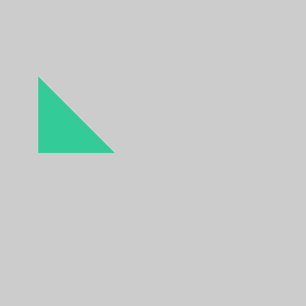
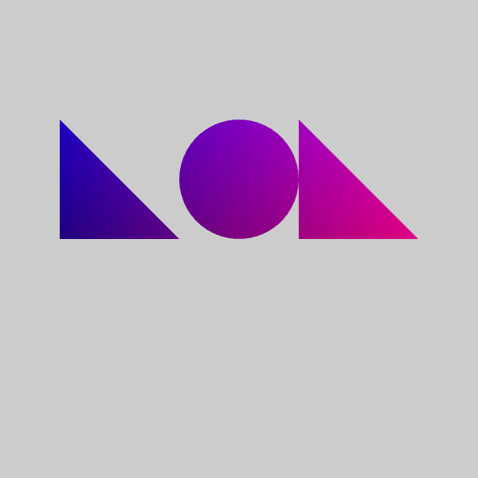
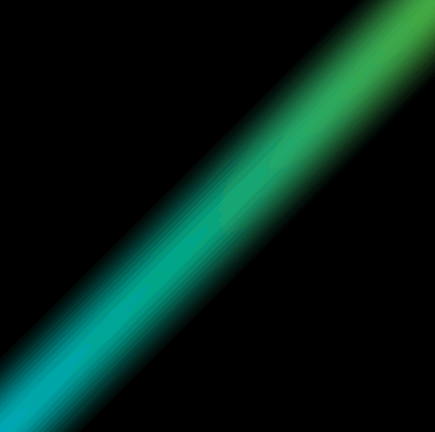

# webg

This is a playground for my self directed curriculum on [WebGL](https://developer.mozilla.org/en-US/docs/Web/API/WebGL_API).
I'm looking at lot at [The Book of Shaders](http://patriciogonzalezvivo.com/2015/thebookofshaders/). More reference links below.
I'd like to eventually have an explanatory comment for every line of code in each branch as well as add more branches. PRs welcome!

### `1-hello triangle` - the hello world of openGL

as bare bones as it gets
this is helpful: http://webglfundamentals.org/webgl/lessons/webgl-fundamentals.html

### `2-LOL` - more than just triangles!

circles are hard to draw: http://engineering.ayasdi.com/2015/05/02/how-to-draw-a-filled-circle-in-webgl/
can't resist a shader toy: https://www.shadertoy.com/view/XsjGDt
and this never gets old: http://i.imgur.com/iFctMlX.gif

### `3-taste the rainbow` - animating colors

[this](http://www.lighthouse3d.com/tutorials/glsl-tutorial/uniform-variables/) is a pretty decent explaination of Uniform variables in GL

### `4-high school math` - remembering linear algebra

these [linear algebra videos](https://www.khanacademy.org/math/linear-algebra) from Khan Academy are a great way to remember SOHCAHTOA.

### `5-turn around flip it and reverse it` - rotating the matrix

i tried to [rotate a world matrix](http://duriansoftware.com/joe/An-intro-to-modern-OpenGL.-Chapter-3:-3D-transformation-and-projection.html) to achieve this (which is the best practice) but I ended up [rotating](https://en.wikipedia.org/wiki/Rotation_matrix#In_two_dimensions) the vertices in the vertex shader; just to be different and illustrate different ways to attain desired results in GL land.

i guess this would have been a good branch to name after a The Matrix reference, but i went with Missy Elliot.

### `6-you spin me right round` - interactive events and atan2

using [atan2](https://en.wikipedia.org/wiki/Atan2) to spin matrix to follow mouse movement.

### `7-move it along` - rotate "model" and "camera"

Honestly... made this spin-y thing a while back and I'm not sure what to do with it at the moment.

### `8-boxing day` - 3D spinning cube

adding some depth to the whole thing.

### `9-if you build it` - wasm

wip: not sure how this will go

### `10-i am a fan` - interactive visual of how circle is constructed
